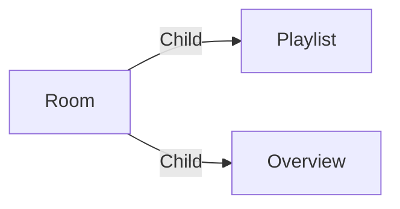

# Room

A **weekend Room** is here to regroup playlists and overview to share them with other users, especially external users, which are not part of the organisation and don't have access to your projects.

More information about a room can be found in the [Rooms interface](../introduction/rooms.md). As a regular user, you can edit the room using the [Rooms editor](../applications/rooms.md) application.

## Data

| Key | Type | Description |
| :--- | :---- | :----------- |
| `name` | `string` | Name of the room |
| `description` | `string` | Description of the room |
| `displays` | `array` | List of displays in the room (`overviews`, `playlists`) |

## Structure

