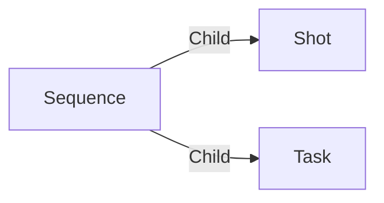

# Sequence

A **movie_creation Sequence** is here to regroup shots together.

A sequence can have tasks too.

## Data

| Key | Type | Description |
| :--- | :---- | :----------- |
| `name` | `string` | Name of the sequence |

## Structure

