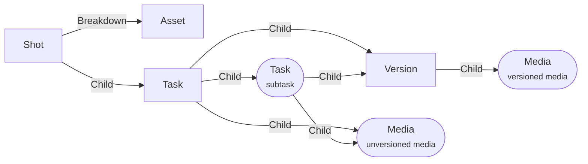

# Shot

A **theaters Shot** is composed by tasks where you can upload medias.

Tasks can have sub-tasks too.

Medias can be regrouped into versions.

The application used by default is [Shot editor](../applications/shoteditor.md).

## Data

| Key | Type | Description |
| :--- | :---- | :----------- |
| `name` | `string` | Name of the asset |
| `description` | `string` | Description of the asset |
| `frameIn` | `number` | Start frame of the shot |
| `frameOut` | `number` | End frame of the shot |

## Structure

