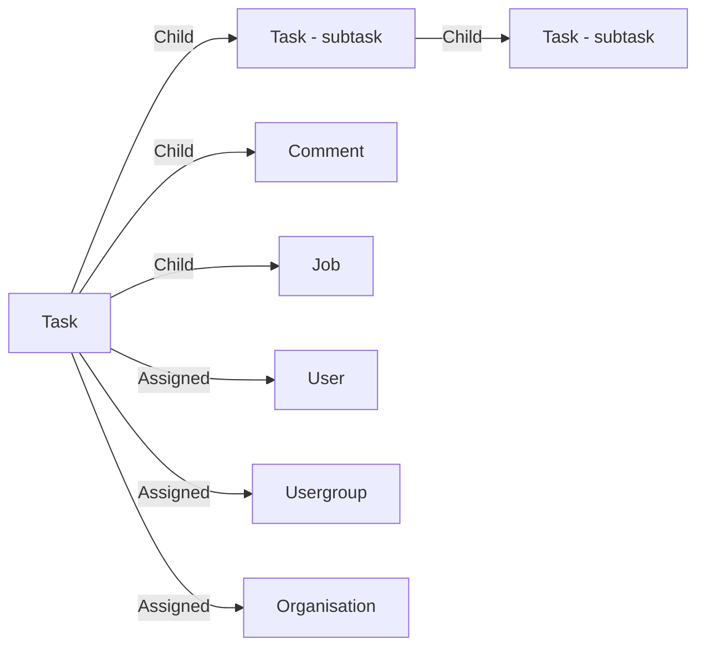

# Task

A **task_alt Task** is here to represent a work/task to do.

A task can have sub-tasks.

A task can be assigned to a [User](./user.md).

## Structure

```mermaid
graph LR
  Task -->|Child| Subtask[Task - subtask]:::Task
  Subtask -->|Child| SubtaskB[Task - subtask]:::Task
  Task -->|Child| Comment
  Task -->|Child| Job
  Task -->|Assigned| User
  Task -->|Assigned| Usergroup
  Task -->|Assigned| Organisation
```