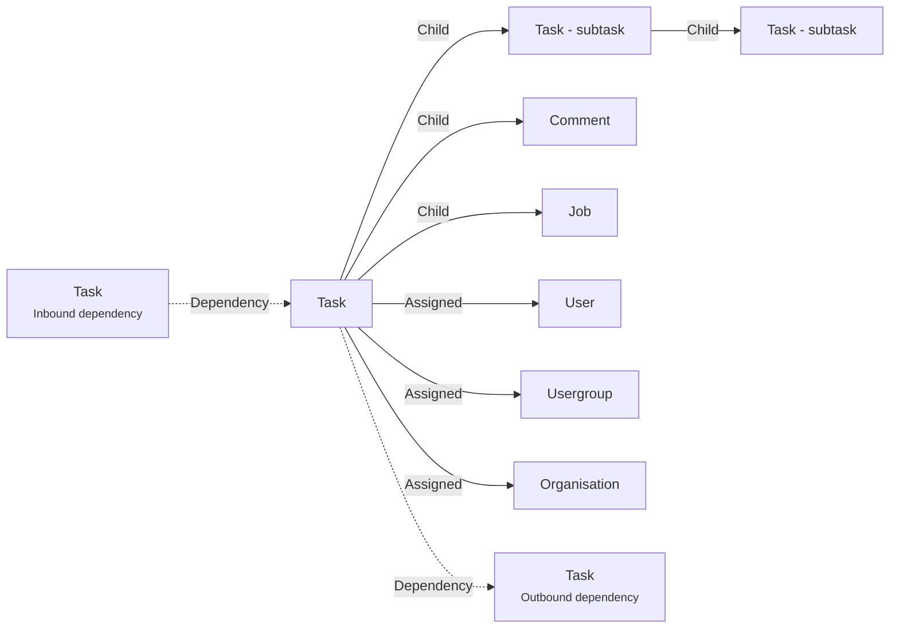

# Task

A **task_alt Task** is here to represent a work/task to do.

A task can have sub-tasks.

A task can be assigned to a [User](./user.md).

The main application used to edit a task is [Tasks editor](../applications/tasks.md).

## Data

| Key | Type | Description |
| :--- | :---- | :----------- |
| `name` | `string` | Name of the task |
| `description` | `string` | Description of the task |
| `status` | `string` | Status of the task |
| `color` | `string` | Color of the task |
| `completion` | `number` | Completion of the task |
| `startdate` | `date` | Start date of the task |
| `deadline` | `date` | Deadline of the task |
| `duration` | `duration` | Duration of the task |
| `priority` | `number` | Priority of the task |
| `bid` | `duration` | Bidding information of the task. Like the duration to more tight to estimated duration |
| `checklist` | `array` | Checklist of the task |
| `steps` | `array` | Steps of the task. Like a milestone dedicated to the task |

## Structure

