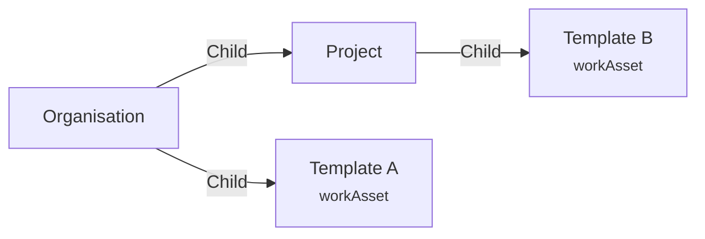
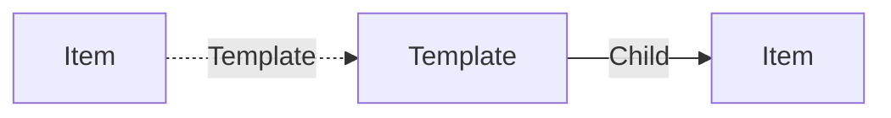
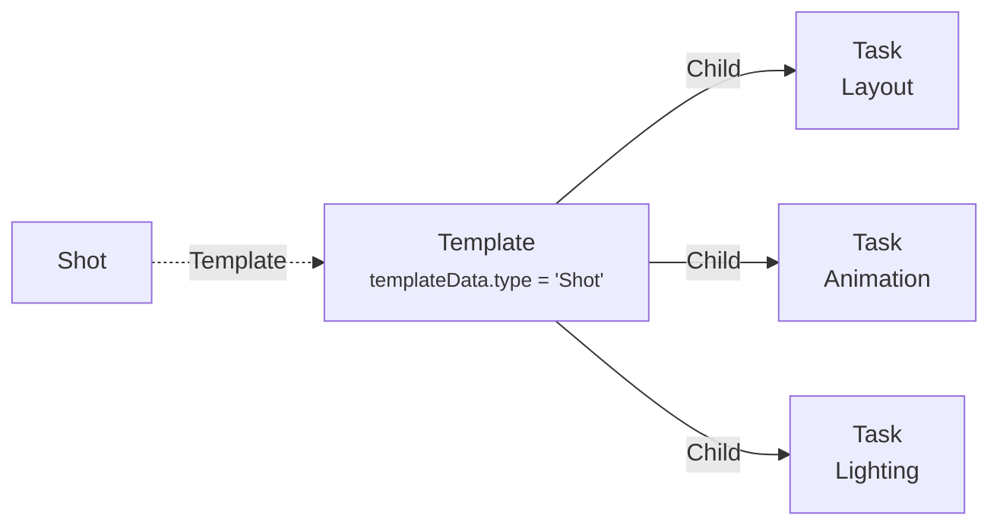

# Template

A **deployed_code Template** is used to create other items with predefined data and structure.

> Example: You can use a template to define the default structure of a shot, with its tasks.

A template can have a form, so when a user will create an item from this template, they will have to fill the form.

You can convert an item into a template using the [Quickeditor application](../applications/quickeditor.md).

You can edit, synchronize, define template form, ... a using the [Template editor application](../applications/templateeditor.md).

When an item is assigned to a template, a dedicated edge `Template` is created from the template to the item.

## Usage

A templates are dependent of the context where they are used. By default templates are hidden at the root of the project.

Let's imagine this configuration :

If you try to create an Asset at the root of the organisation, only `Template A` will be available.

If you try to create an Asset in the project, 2 templates will be available: `Template A` and `Template B`. In this case `Template B` will be selected by default because it is closer to the project. If two templates are at the same level, they will be ordered alphabetically.

## Data

| Key | Type | Description |
| :--- | :---- | :----------- |
| `name` | `string` | Name of the template |
| `description` | `string` | Description of the template |
| `templateData` | `object` | Data of the template |

<$>[warning]
All the root data of the template will be copied to the new item, except the `templateData` property.
<$>

### Template Data

The `templateData` object is a JSON object that contains the data of the template.

| Key | Type | Description |
| :--- | :---- | :----------- |
| `type` | `string` | Type of the item that will be created |
| `form` | `object` | A custom form displayed to the user when they create the item |

## Structure

Here is an example of a Shot's template :

