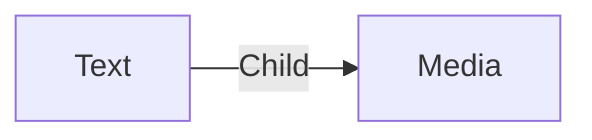

# Text

A **insert_drive_file Text** is simply a text. You can display text items using a [Wiki workspace](../workspaces/wiki.md).

Text are written in Markdown.

You can store media in a Text item if you upload a media that need to be added in the text.

## Data

| Key | Type | Description |
| :--- | :---- | :----------- |
| `name` | `string` | Name of the text |
| `content` | `string` | Content of the text in markdown |

## Structure

