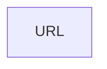

# URL

A **link URL** is a link to a web page.

## Data

| Key | Type | Description |
| :--- | :---- | :----------- |
| `name` | `string` | Name of the URL |
| `link` | `string` | URL of the web page |

## Structure

