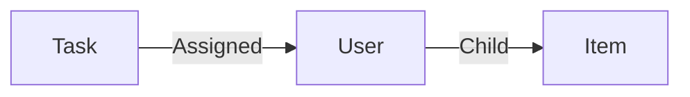

# User

A **person User** is a human that use Aquarium and its able to access to the web interface.

A user can update its own profile, change its password, from its [Profile application](../applications/profile.md).

Administrators, can can be enable or disable users from the [Domain application](../applications/domain.md).

# Data

| Key | Type | Description |
| :--- | :---- | :----------- |
| `name` | `string` | Name of the user |
| `email` | `string` | Email of the user |
| `ui` | `string` | User default interface (`focus`, `studio` or `rooms`) |
| `thumbnail` | `string` | URL of the user thumbnail |

# Structure

