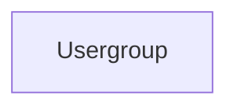

# Usergroup

A **group Usergroup** is a group of users that can be used to manage permissions in Aquarium.

You can create a usergroup anywhere you want, but the most common place is in the [Organisation application](../applications/domain.md) or from [Project settings](../applications/projectsettings.md).

## Data

| Key | Type | Description |
| :--- | :---- | :----------- |
| `name` | `string` | Name of the usergroup |
| `description` | `string` | Description of the usergroup |

## Structure

