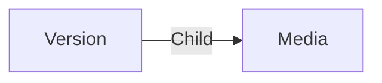

# Version

A **work_history Version** is here to regroup multiple media items that are related to the same version of a project.

## Data

| Key | Type | Description |
| :--- | :---- | :----------- |
| `name` | `string` | Name of the version |

## Structure

