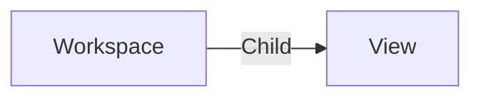

# View

A **view_carousel View** is used in [workspaces](./workspace.md) to regroup columns together.

We provide presets to help you create a view. You can also [create your own columns](../../examples/tutorials/create-column.md).

A view can be edited from the [workspace editor](../applications/workspaces.md) or with the [view editor](../applications/views.md).

## Data

| Key | Type | Description |
| :--- | :---- | :----------- |
| `name` | `string` | Name of the view |
| `description` | `string` | Description of the view |
| `columns` | `array` | List of columns used in the view |

### Column

| Key | Type | Description |
| :--- | :---- | :----------- |
| `name` | `string` | Name of the column |
| `labelColor` | `string` | Color of the column |
| `applyLabelColorInCells` | `boolean` | Apply the label color in the cells |
| `preset` | `string` | Preset configuration for the column |
| `type` | `string` | Type of the column (e.g., badge) |
| `width` | `string` | Width of the column |
| `depth` | `number` | Depth level of the column |
| `set` | `object` | Set configuration for the column |
| `data` | `object` | Data configuration for the column |
| `id` | `string` | Unique identifier for the column |
| `app` | `string` | Application associated with the column |
| `appParams` | `object` | Parameters for the associated application |
| `itemName` | `string` | Name of the item in the column |
| `hidden` | `boolean` | Visibility status of the column |

## Structure

