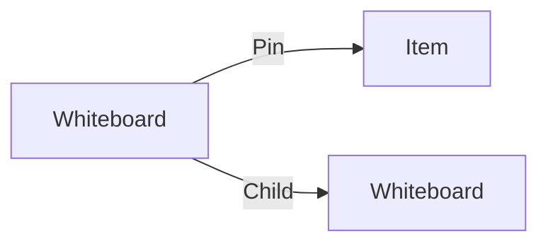

# Whiteboard

A **timeline Whiteboard** is big canvas where you can add post-it, media, backdrop, milestone and more to create boards for your projects.

You can use them as reference, brainstorming, planning, meeting, ...

## Data

| Key | Type | Description |
| :--- | :---- | :----------- |
| `name` | `string` | Name of the whiteboard |

## Structure

