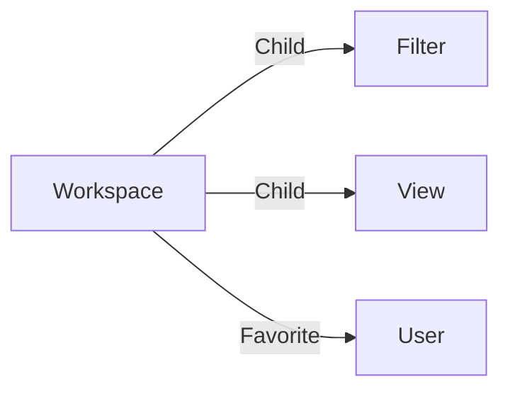

# Workspace

A **chrome_reader_mode Workspace** is the item dedicated to store your display options (columns, filters, groups, ...)

Find out more in the dedicated [workspace section](../workspaces/index.md).

A workspace can be edited with the [workspace editor](../applications/workspaces.md).

## Data

| Key | Type | Description |
| :--- | :---- | :----------- |
| `name` | `string` | Name of the workspace |
| `description` | `string` | Description of the workspace |
| `appName` | `string` | The name of the workspace application to use |
| `displayMode` | `string` | Display mode of the workspace (`table`, `list`, ...) |
| `availableTypes` | `array` | List of item types available for creation in the workspace |
| `groups` | `object` | Grouping options |
| `sort` | `string` | Sorting options |
| `sets` | `object` | Sets used in the queries |
| `search` | `string` | Keyword search filter |
| `filters` | `array` | Filters options |
| `useDefaultFilter` | `boolean` | Use default application filter |
| `useDefaultView` | `boolean` | Use default application view |

# Structure

