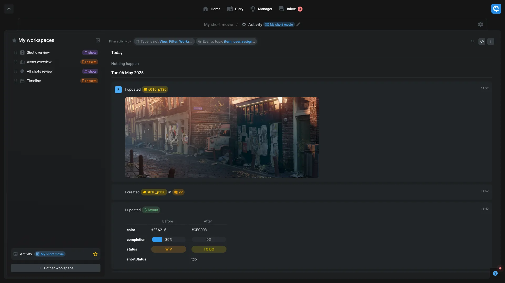

# Activity

This workspace is user to display all activity related to the current location. It's reading all events that happenned on the releated items and displaying them in a news feed style.

You can use the filters to only show the activity from specific items and choose what type of activity you want to display.

> [!INFO]
> If you want to display all items' activities, just write `item` in the `Event's topic` filter. For only show item updates activities, write `item.updated`, ...