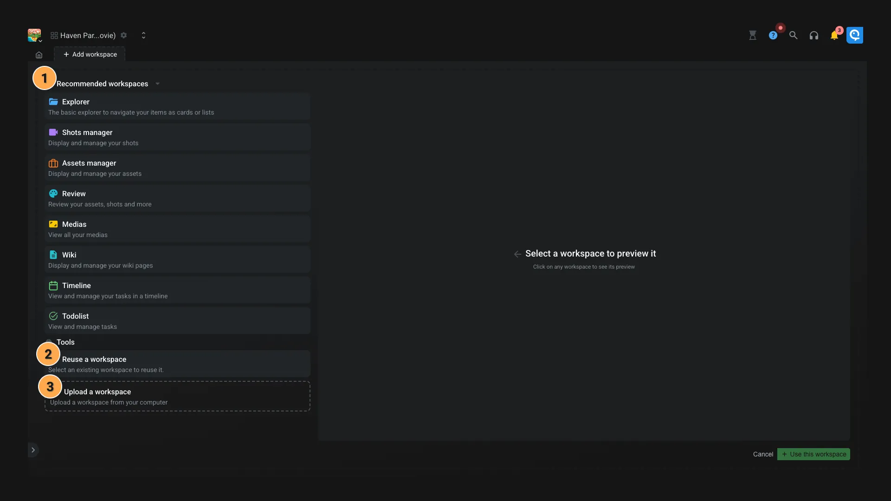

# New workspace

You will have access to this interface when you create a new workspace from the [studio](../introduction/studio.md) interface.

1. On the left side, you can see the list of recommended workspaces. You can click on the workspace you want to preview it. If you want to keep it, you can click on the **Use this workspace** button at the bottom right of the screen.
2. You can also import a workspace from a .json file. Learn how to [export a workspace with our tutorial](https://www.youtube.com/watch?v=rHd9-REis40).
3. If you prefer to reuse an existing workspace, you can use this tool to browse your projects and workspaces.

