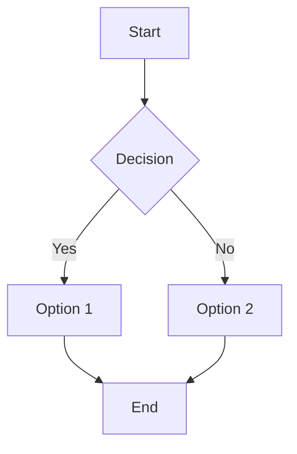
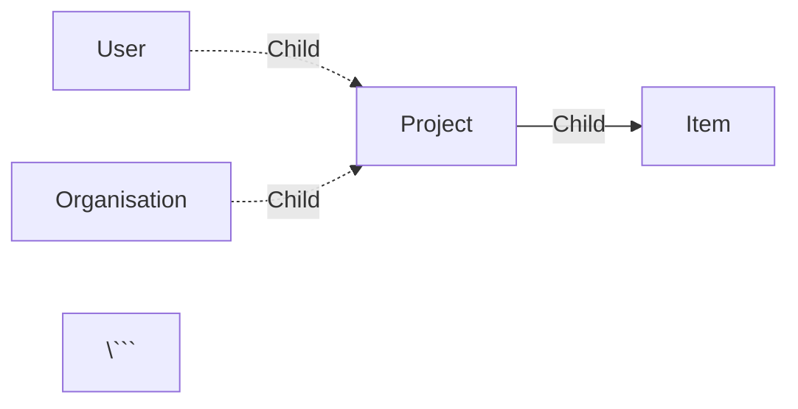
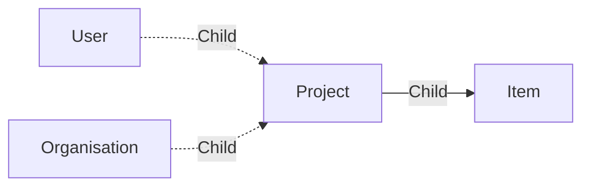

# Wiki

This workspace is dedicated to display your text items. This workspace is useful to create a wiki, a documentation, meetings notes, project presentation, ...


In the left sidebar, you can see the list of your pages. You can create a new page by clicking on the <span class="aq-icon">add</span> icon. You also have the ability to create sub-pages by clicking on the <span class="aq-icon">add</span> icon next to an existing page.

Grab a page to reorder it, or drag it to another page to move the selected page as a sub-page (and inverse).

The pages can be written in **Markdown**, providing you with a lot of formatting options.

## Markdown Formatting

### Titles

You can create titles using the `#` symbol. The number of `#` symbols indicates the level of the title, from 1 to 6.

- `# Title 1`
- `## Title 2`
- `### Title 3`
- `#### Title 4`
- `##### Title 5`
- `###### Title 6`

### Formatting

You can format your text using the following Markdown syntax:

| Markdown | Result |
| :-------- | :------ |
| `**Bold**` | **Bold** |
| `*Italic*` | *Italic* |
| `~~Strikethrough~~` | ~~Strikethrough~~ |
| `> Blockquote` | > Blockquote |
| `- List item` | - List item |
| `1. Numbered item` | 1. Numbered item |
| \`Inline code` | `Inline code` |
| \```Code block``` | ```Code block``` |

You can can also create an horizontal rule using three dashes:

```
---
```
---

### Links and Images


| Markdown | Result |
| :------- |  :----- |
| `[Link](https://fatfi.sh)` | [Link](https://fatfi.sh) |
| `` |  |
| `` |  |

> [!note] Image size
> You can specify the size of the image by adding `width=VALUE` or `height=VALUE`. The `VALUE` can be in pixels (e.g., `width=250px`) or percentage (e.g., `width=50%`). If you specify both width and height, the image will be resized accordingly.

### Highlights & Callouts

Using the following syntax, you can create callouts:

```
> [!callout-type]
> Content
```

The following callout types are available:

- `note`
- `info`
- `warning`
- `error`

> [!note] Note title
> This is a note callout.

### Video Embedding

You can embed videos using the following syntax:

```
[youtube VIDEO_ID WIDTH HEIGHT]
```

Where `VIDEO_ID` is the ID of the YouTube video, and `WIDTH` and `HEIGHT` are the width and height of the video player in pixels.

For example the following code `[youtube yagxU7c7lQA 405 720]` will embed the video with ID `yagxU7c7lQA` with a width of 405 pixels and a height of 720 pixels.

[youtube yagxU7c7lQA 405 720]

### Table

You can create tables using the following syntax:

```
| Header 1 | Header 2 |
| -------- | -------- |
| Row 1.1  | Row 2.1  |
| Row 1.2  | Row 2.2  |
```

| Header 1 | Header 2 |
| -------- | -------- |
| Row 1.1  | Row 2.1  |
| Row 1.2  | Row 2.2  |

### Schema and graphs using Mermaid

You can create diagrams and graphs using [Mermaid](https://mermaid.js.org/) syntax. Here is an example of a flowchart:

```
```mermaid
flowchart TD
    A[Start] --> B{Decision}
    B -->|Yes| C[Option 1]
    B -->|No| D[Option 2]
    C --> E[End]
    D --> E
\```
> The \ above backslash is used to escape the code block in this markdown file.
```



We are embedding a special notation to automatically color items using their type instead of letters like `A`, `B`, ...
For example, you can use the following syntax to create such diagram:


```




> [!note]
> You can use the online Mermaid live editor to discover more about Mermaid syntax and play with it: [Mermaid Live Editor](https://mermaid.live). AI and other tools can help you generate Mermaid diagrams based on your text descriptions.
